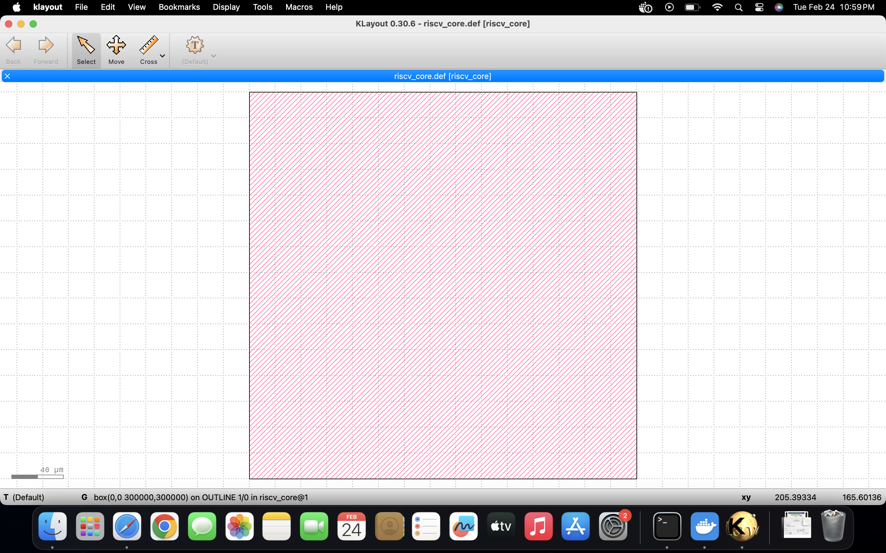
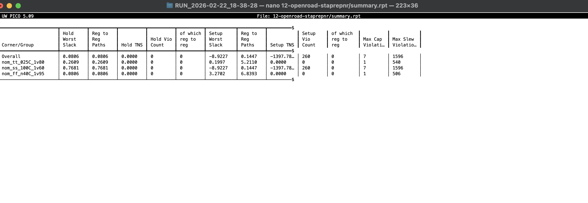
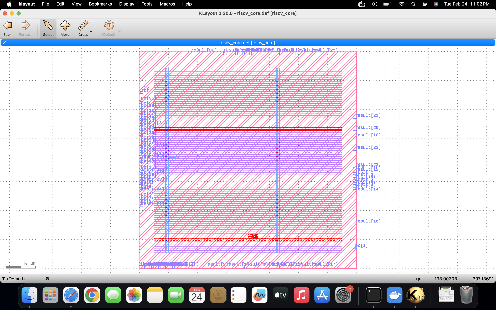
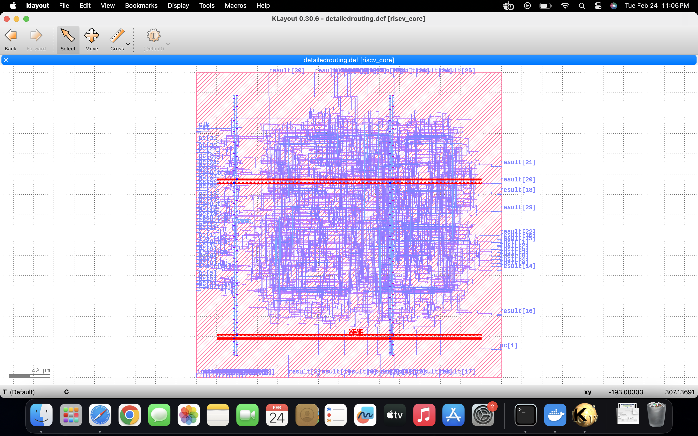
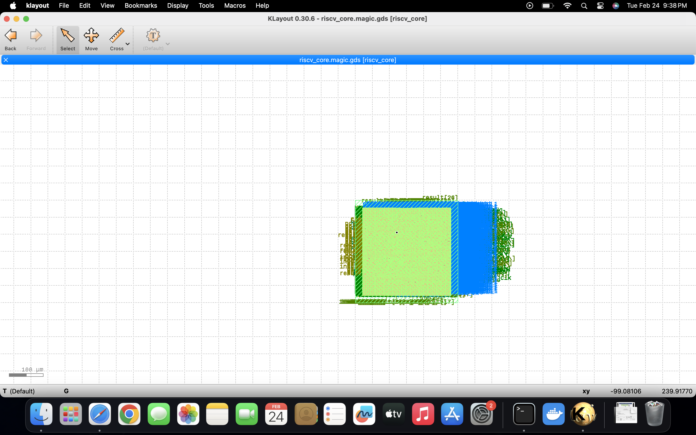

# 🚀 Monolithic RISC-V Core — RTL to GDSII (SKY130)

## 📌 Project Overview

This project demonstrates the complete **RTL-to-GDSII physical design flow** of a monolithic RISC-V processor core implemented using open-source VLSI tools.

The design implements a functional RISC-V compute core supporting arithmetic and logic operations and is successfully fabricated through the full ASIC backend flow.

---

## 🛠 Tools Used

* RTL Simulation: Verilog
* Synthesis: Yosys
* Physical Design: OpenROAD
* Flow Framework: OpenLane
* DRC/LVS: Magic & Netgen
* Visualization: KLayout
* PDK: SKY130 (SkyWater 130nm)

---

## ⚙️ Design Flow

1. RTL design & simulation
2. Logic synthesis
3. Floorplanning
4. Placement
5. Clock Tree Synthesis
6. Routing
7. STA validation
8. DRC & LVS verification
9. GDSII generation

---

## 📊 Key Results

### Area

* Core Area: **66,333 µm²**
* Standard Cell Area: **20,430 µm²**
* Utilization: **30.8%**

### Timing

* Hold violations: **0**
* Setup slack (post-PNR worst): **-0.436 ns**
* Clock sinks: **318**

### Physical Verification

* DRC: ✅ Clean
* LVS: ✅ Match
* Antenna: ✅ Clean

---

## 🖼 Design Snapshots

| Stage            | Image                            |
| ---------------- | -------------------------------- |
| Floorplan        |         |
| Placement        |               |
| Routing          |           |
| Detailed Routing |  |
| GDS              |           |

---

## 🔮 Future Work

* Pipeline implementation
* Cache hierarchy integration
* Hazard detection & forwarding
* Branch prediction
* Full RV32I compliance
* Performance optimization

---

## 👩‍💻 Author

Shubhashri Joshi
VLSI Engineer

---

